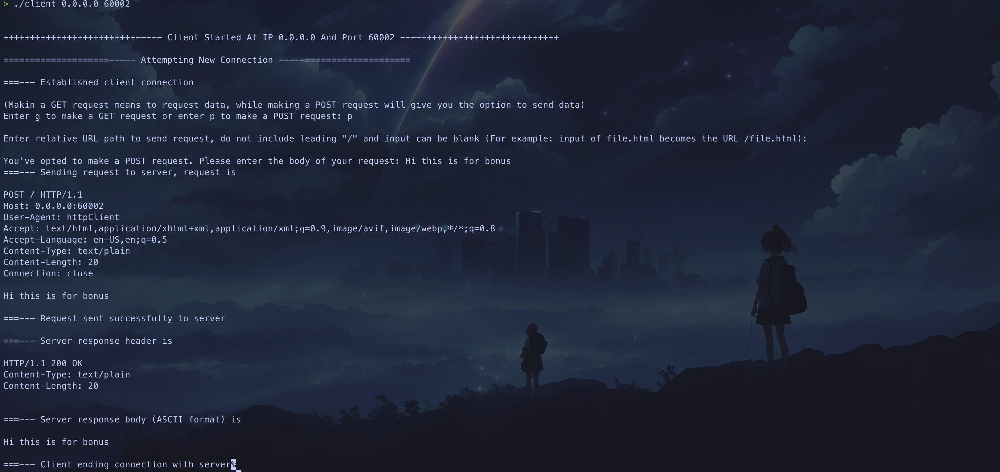

# Project One (HTTP Server)

## Project Members
- Chase Lamkin

## Directions on compiling and running
To run this program navigate to base directory and run ```make```. This will make executable files ```server``` and ```client```.

- To execute ```server``` you can run ```./server``` (it will use default port value and IF_ANY) or ```./server <ip_addr> <port_addr>```
- To execute ```client``` you can run ```./client```(it will use default port value and IF_ANY) or ```./client <ip_addr> <port_addr>``` or ```./client <ip_addr> <port_addr> <resource_path>```

> [!IMPORTANT]
> Ensure that the port (default or specified) is available 

> [!IMPORTANT]
> If you run ```./client <ip_addr> <port_addr>``` or ```./client``` it will give the user the option to specify the type of request (GET or POST) as well as where to make that request and what the http body should be.
> This fulfills the bonus points for this project as it allows the user to send HTTP post requests with text

> [!IMPORTANT]
> When specifying <resource_path> do not include the leading ```/``` and also use the relative directory from where the httpServer is running. For example - to get testPresence.html you would simply input testPresence.html and not /testPresence.html
> This is because the httpClient will prepend the resource with a ```/``` to make the full URL

> [!IMPORTANT]
> Before running ./client make sure to run ./server. If you run either of them with default settings make sure to run the other with default settings.

## Sample Input For Grader to Use

> [!NOTE]
> Before running these run ```./server 0.0.0.0 60002```

- ```./client 0.0.0.0 60002 img.jpg```
- ```./client 0.0.0.0 60002 testPresence.html```
- ```./client 0.0.0.0 60002 fake.html```
- ```./client 0.0.0.0 60002 index.html```
- ```./client 0.0.0.0 60002``` (hit p for POST and type some input for the bonus points output)

## Functionality

The user is able to run the ./client program as specified above. I recommend just running ```./client``` and inputting data as necessary as it is much simpler and will use the default server and client settings.

## Error-Handling (Client)
If a user requests a resource occassionally the recv stream won't receive all necessary bytes especially for large requests (i.e a request for img.jpg). To handle this, the bytes recv are subtracted by the number of header bytes. Then that value is continuously compared to the expected Content-Length until the expected value is reached.

## Error-Handling (Server)
If a user navigates to an invalid path the server will respond with a 404 Not Found response, which will notify the user that the path is invalid.

The only time the server will halt itself completely is on during start-up if the function ```bind```, ```listen``` or ```socket``` (for the server file descriptor) fail. This is because the server needs a clean start up to avoid errors, if a client connection gives errors the server will not shut down, it will simply close the connection and wait for the next client.


> [!NOTE]
> The only error likely to be encountered is ```[ERROR] could not bind address for server: Address already in use```. This occurrs occassionally if the server was just ran and then re-ran again. This is intended and prevents the program from crashing.

## BONUS
The bonus has been complete. Utilize ```./client``` to make a post request and see the server send that post request and receive the response. On the server side it also differentiates between the two types of requests.

Here are the two print statements on the server side that differentiate the two:
- fprintf(stdout, "===---Received a resource GET request. The response Content-Length is %ld, the status code is 200 OK, and the resource being sent is %s\n\n", file_len, filepath);
- fprintf(stdout, "===---Received a text POST request. The response status code is 200 OK, and the text being sent is %s\n\n", res_text);

## Images of Running Application

### Requesting home page


### Requesting img.jpg


### Requesting testPresence.html


### Requesting fake.html


### Bonus points



