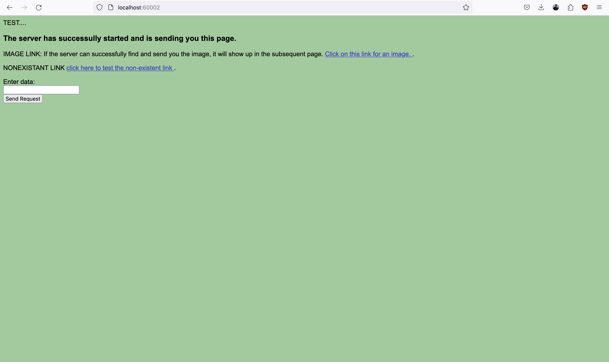

# Project One (HTTP Server)

## Project Members
- Chase Lamkin

## Directions on compiling and running
To run this program navigate to base directory and run ```make```. This will the executable file ```server```. To execute this file, run the command ```./server```, this will run the program on the port ```600002```.

> [!IMPORTANT]
> Ensure that the port is available. If the port is not available you can change the port used by changing the line ```#define SERVER_PORT 60002``` (line number 11) in the file ```server.h``` as well as by changing the ```http://localhost:<port>``` line inside of index.html  

## Functionality
The server will allow the user to navigate to the url paths ```/```, ```/testPresence.html```, and ```fake.html``` from the link ```http://localhost:60002``` in any modern web browser. It will also allow the user to type any input into a text field on the home screen, and upon hitting submit a spinner will spin at the center of the screen until the web page receives a response. Once the web page has received a response it will show an ```alert```, which repeats the input (http body) the server received from the client.

In addition to that the server will output strings to the console, for the user to see what input it is receiving.
Some of the things the server will print to the console while running are:
- When a new socket connection has been made (_previous connection with a client was severed and a new one was found_)
- The entire request body and header received from each client request
- The type of request received
- The path of the request or body of the request (depending on if the request is a GET or POST request)
- When the server has started to send a response
- Information about the response sent such as content-length, file path, response body etc (GET and POST display different information)
- If the response sent was successful

> [!NOTE]
> The input from sockets will be done in a ```while(1)```, as specified in the instructions. So this output will continuously be printed to the console for every request made and the server will only stop when interrupted (via control+C on most machines)

## Extra-Functionality
This server is built to be extra extendable. This means that to add another path and output file, or another endpoint for post requests just by adding a one line, function call to ```_send_file_res``` or ```_send_text_res``` inside of ```handle_req```. 

Another added functionality is that anytime a GET request to a path (for example - ```/dir1/dir2/file.html```) is made, if the URL path is a valid relative path to an existing file inside the project1 directory, that file will be served to the user. This means that paths such as ```/img.png``` are valid and will display the image only. The server handles the headers automatically for all file types.

## Error-Handling
If a user navigates to an invalid path the server will respond with a 404 Not Found response, which will notify the user that the path is invalid.

The only time the server will halt itself completely is on during start-up if the function ```bind```, ```listen``` or ```socket``` (for the server file descriptor) fail. This is because the server needs a clean start up to avoid errors, if a client connection gives errors the server will not shut down, it will simply close the connection and wait for the next client.

> [!NOTE]
> The only error likely to be encountered is ```[ERROR] could not bind address for server: Address already in use```. This occurrs occassionally if the server was just ran and then re-ran again. This is intended and prevents the program from crashing.

## BONUS
The bonus has been complete and a description is available in the ```Functionality``` section of this README file.

## Images of Running Application

### Home page (path /)



### Descriptive server output (on terminal)


### test presence page (path /testPresence.html)


### fake page (path /fake.html)


### bonus points 
***any text inputed into the homepage text box will be submitted to server when button is clicked, once the server responds, an alert with the server response, which is the same as the input, will display***


